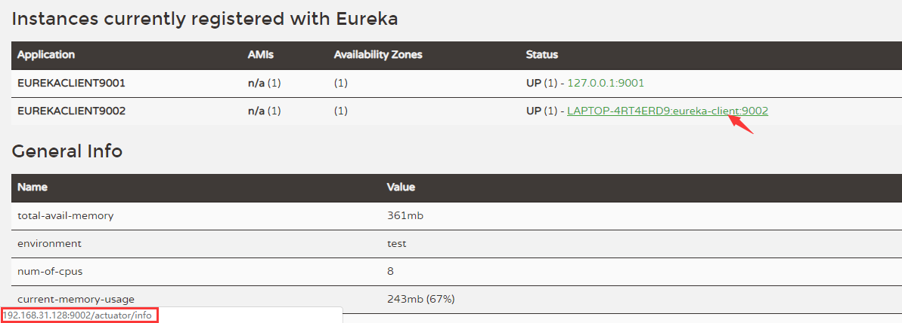

<h1 style="text-align:center">SpringCloud</h1>


# 1.服务注册与发现-Eureka

Eureka采用了CS的设计架构，Eureka Server作为服务注册功能的服务器，它是服务注册中心。而系统中的其他微服务，使用Eureka的客户端连接到Eureka Server并维持心跳连接。这样系统的维护人员就可以通过Eureka Server来监控系统中各个微服务是否正常运行。
在服务注册与发现中，有一个注册中心。当服务器启动的时候，会把当前自己服务器的信息比如服务地址通讯地址等以别名方式注册到注册中心上。另一方(消费者|服务提供者) , 以该别名的方式去注册中心上获取到实际的服务通讯地址，然后再实现本地RPC调用RPC远程调用框架核心设计思想:在于注册中心，因为使用注册中心管理每个服务与服务之间的一个依赖关系(服务治理概念)。在任何RPC远程框架中，都会有一个注册中心(存放服务地址相关信息(接口地址))


##  1.1 核心组件

### 1.1.1 Eureka Server

**Eureka Server **提供服务注册服务
各个微服务节点通过配置启动后，会在EurekaServer中进行注册， 这样EurekaServer中的服务注册表中将会存储所有可用服务节点的信息，服务节点的信息可以在界面中直观看到。

```xml
<dependency>
	<groupId>org.springframework.cloud</groupId>
	<artifactId>spring-cloud-starter-netflix-eureka-server</artifactId>
</dependency>
```

```yaml
server:
  port: 8081
eureka:
  instance:
#    服务端的实例名称
    hostname: localhost
  client:
#    是否在注册中心注册自己
    register-with-eureka: false
#    false表示自己就是注册中心
    fetch-registry: false
#    设置eureka server交互的地址查询服务和注册服务都需要依赖这个地址
    service-url:
      defaultZone: http://${eureka.instance.hostname}:${server.port}/eureka/
```

访问地址：http://localhost:8081/

### 1.1.2 Eureka Client

**Eureka Client** 检查注册中新的服务是否还有心跳
是一个Java客户端，用于简化Eureka Server的交互，客户端同时也具备一个内置的、 使用轮询(round-robin)负载算法的负载均衡器在应用启动后，将会向Eureka Server发送心跳(默认周期为30秒)。 如果Eureka Server在多个心跳周期内没有接收到某个节点的心跳，EurekaServer将会从服务注册表中把这个服务节点移除(默认90秒)。

```xml
<dependency>
	<groupId>org.springframework.cloud</groupId>
	<artifactId>spring-cloud-starter-netflix-eureka-client</artifactId>
</dependency>
```

```yaml
eureka:
  client:
    #    是否在注册中心注册自己
    register-with-eureka: true
    #    false表示自己就是注册中心
    fetch-registry: true
    #    设置eureka server交互的地址查询服务和注册服务都需要依赖这个地址
    service-url:
      defaultZone: http://localhost:8081/eureka
```

### 1.1.3 集群配置 Eureka Server  Cluster

1. 修改C:\Windows\System32\drivers\etc\hosts

	```
		127.0.0.1       server8081
		127.0.0.1       server8091
	```

2. Server 相互注册指向对方地址

	server 8081:

	```yaml
	server:
	  port: 8081
	eureka:
	  instance:
	#    服务端的实例名称
	    hostname: server8081
	  client:
	#    是否在注册中心注册自己
	    register-with-eureka: false
	#    false表示自己就是注册中心
	    fetch-registry: false
	#    设置eureka server交互的地址查询服务和注册服务都需要依赖这个地址
	    service-url:
	      defaultZone: http://server8091:8091/eureka/
	```

	server 8091:

	```yaml
	server:
	  port: 8091
	eureka:
	  instance:
	    #    服务端的实例名称
	    hostname: server8091
	  client:
	    #    是否在注册中心注册自己
	    register-with-eureka: false
	    #    false表示自己就是注册中心
	    fetch-registry: false
	    #    设置eureka server交互的地址查询服务和注册服务都需要依赖这个地址
	    service-url:
	#      集群相互注册
	      defaultZone: http://server8081:8081/eureka/
	```
	
3. 客户端注册：

	```yaml
	server:
	  port: 8082
	eureka:
	  client:
	    #    是否在注册中心注册自己
	    register-with-eureka: true
	    #    false表示自己就是注册中心
	    fetch-registry: true
	    #    设置eureka server交互的地址查询服务和注册服务都需要依赖这个地址
	    service-url:
	#      单机版
	#      defaultZone: http://localhost:8081/eureka
	#集群
	      defaultZone: http://server8081:8081/eureka/,http://server8091:8091/eureka/
	```

	

	访问 server 8091 服务：

	

​	

### 1.1.4 集群配置 Eureka Client Cluster

#### 1.1.4.1 客户端配置

```yaml
server:
  port: 9002

eureka:
  client:
    register-with-eureka: true
    fetch-registry: true
    service-url:
      defaultZone: http://eureka-server-8001:8001/eureka/,http://eureka-server-8002:8002/eureka/
spring:
  application:
    name: eureka-client
```


配置 eureka.instance.appname

```yaml
eureka:
  instance:
    appname: eurekaclient9002
```


配置：eureka.instance.prefer-ip-address

```yaml
eureka:
  instance:
    appname: eurekaclient9002
    prefer-ip-address: true
```



配置：instance-id

```yaml
eureka:
  instance:
  	#默认注册到服务中心，显示的名称是 hostname+appname+port
    appname: eurekaclient9002 
    #使用ip地址来注册到服务中心，显示的是实例名称
    prefer-ip-address: true 
    #设置访问服务的ip地址，一般设置ip-address，都是因为需要通过外网来访问该服务，通常设置为公网ip
    ip-address: 127.0.0.1 
    #设置 注册服务中心，显示的实例名称
    instance-id: ${eureka.instance.ip-address}:${server.port}
```


集群配置相同 eureka.instance.appname

```yaml
eureka:
  instance:
    appname: eurekaclient
```


#### 1.1.4.2 开启负载均衡（@LoadBalanced）：

```java
@SpringBootApplication
public class ConsumerApplication {
    public static void main(String[] args){
        SpringApplication.run(ConsumerApplication.class,args);
    }
    @Bean
    @LoadBalanced
    public RestTemplate restTemplate(){
        return new RestTemplate();
    }
}
```

#### 1.1.4.3 消费者调用

consumer使用服务名调用客户端：

http://EUREKACLIENT

```java
RestTemplate rest = new RestTemplate();

rest.getForObject("http://EUREKACLIENT", Map.class,"id=1");
```