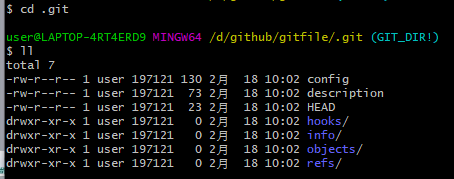
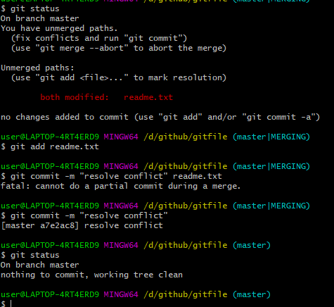
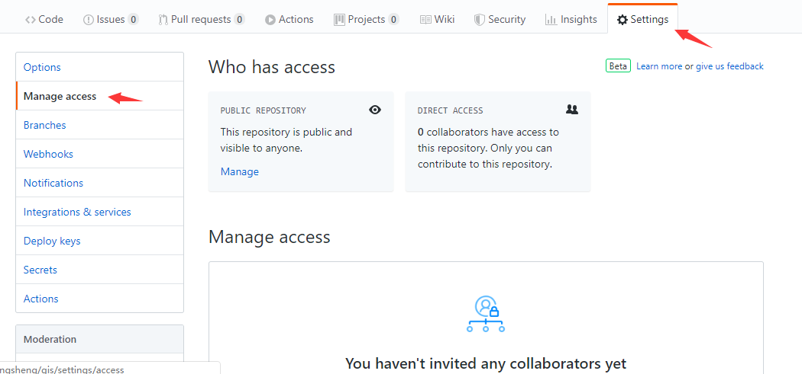
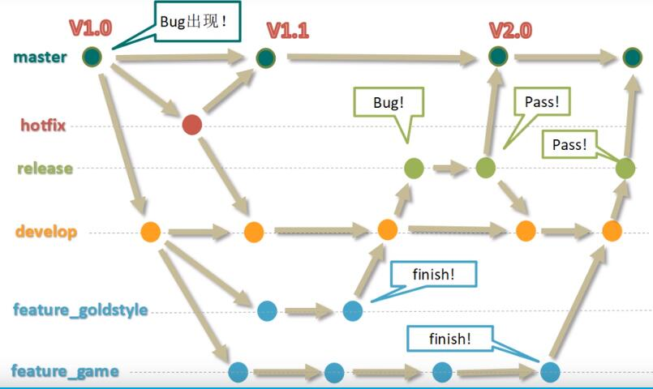

<h1 style="text-align:center">Git使用</h1>
# 1.命令行操作

## 1.1 本地库操作

### 1.1.1 本地库初始化

命令： git init

效果：



注意：.git目录中存放的是本地库相关的子目录和文件，不能删除和修改。

### 1.1.2 设置签名

作用：区分不同的开发人员身份

格式：

​		用户名：pms

​		Email:pms@126.com

注意：这里设置的签名和登录远程库（代码托管中心）的账号、密码没有任何关系。

命令：

  * 项目级别/仓库级别：仅在当前本地库范围内有效

    ``` bash
    git config user.name pms
    git config user.email pms@126.com
    ```

    

  * 系统用户级别：登录当前操作系统的用户范围

    ```shell
    git config --global user.name pms
    
    git config --global user.email pms@126.com
    ```

    

  * 级别优先级：

    * 就近原则：项目级别优先系统用户级别，二者都有时采用项目级别
    * 如果只有系统用户级别的签名，就以系统用户级别的签名为准
    * 二者至少有其中一个

### 1.1.2 基本操作

#### 1.查看状态

```shell
git status
```

#### 2.添加操作

```shell
--添加文件
git add 文件名
--添加所有文件
git add .
```

将新增、修改文件添加到暂存区。

#### 3.提交操作

```shell
git commit -m "message" 文件名
```

将文件提交到本地代码库。

#### 4.查看历史记录：

```powershell
git log
commit d209d21c49646cc5bb406bbef583e4a8030f5490
Author: pms <pms@126.com>
Date:   Tue Feb 18 10:37:43 2020 +0800

    add readme file
--简洁模式
git log --pretty=online
c56f2046c0dbc3b4ae46b62a7bfb4bb83ff0e319 (HEAD -> master) update
d209d21c49646cc5bb406bbef583e4a8030f5490 add readme file

git log --oneline
c56f204 (HEAD -> master) update
d209d21 add readme file

--HEAD@{移动到当前版本需要多少步}
git reflog
c56f204 (HEAD -> master) HEAD@{0}: commit: update
d209d21 HEAD@{1}: commit (initial): add readme file

```


#### 5.版本前进/回退

* 基于索引值【推荐】

  ```shell
  git reset --hard 索引值
  ```

  

* 使用^符号:只能后退

  ```shell
  git reset --hard HEAD^
  ```

  一个^后退一步，N个^后退N步。

  

* 使用~符号

  ```shell
  git reset --hard HEAD~1
  ```

  HEAD~n 后退到第n步

#### 6.删除文件后并找回

回退到删除前版本

```shell
git reset --hard [指针位置]
```


#### 7.文件版本比较

```shell
git diff 文件名
--将工作区中的文件和暂存区进行比较
git diff 【本地库历史版本】【文件名】
--将工作区中的文件和本地库历史记录比较
```

## 1.2 分支管理

#### 1.2.1 分支的优点

* 同时并行推进多个功能开发，提高开发效率；
* 各个分支在开发过程中，如果某一个分支开发失败，不会对其他分支造成影响，失败分支删除重新开始即可。

#### 1.2.2 分支操作

1. 创建分支

   ```shell
   git branch [分支名]
   --创建并切换
   git branch -b [分支名]
   ```

2. 查看分支

   ```shell
   git branch -v
   ```

3. 切换分支

   ```shell
   git checkout [分支名]
   ```

4. 合并分支

   * 切换到被合并的分支上

   * 执行merge命令

   ```shell
   --在master中新建分支
   git checkout [新建分支名]
   --在master中合并新建分支
   git merge [新建分支名]
   ```

5. 解决冲突

   1. 删除冲突部分特殊符号

   2. git add 冲突文件

   3. git commit -m "日志信息"

      

   

   ### 1.3 代码提交到远程库

   #### 1.3.1 push 推送本地代码到远程

   git push <远程主机名 可省略> <本地分支名> <远程分支名>
   
   ```shell
   --将远程库地址取别名存到本地
   git remote add pmsgithub https://github.com/pengmengsheng/pengmengsheng.github.io.git
   --将本地master分支提交到远程origin对应的master分支
git push origin master
   ```
   
   

#### 1.2.3 clone 克隆远程库代码

```shell
git clone https://github.com/pengmengsheng/pengmengsheng.github.io.git
```

命令的结果：

* 完整的把远程库下载到本地

* 创建origin远程地址别名

* 初始化本地库

#### 1.2.4 邀请加入团队



#### 1.2.5 pull 拉取代码

pull命令相当于 fetch+merge两个操作命令

1. git fetch [远程地址别名] [远程分支名]：下载远程文件
2. git merge [远程地址别名]/[远程分支名]:与本地库进行合并

#### 1.2.6 跨团队提交

1. 先fork项目,修改 push到远程
2. pull request

## 1.3 Git 使用中简易遵循 Git 标准 Flow

### 1.3.1 Git Flow常用的分支

- Production 分支

也就是我们经常使用的Master分支，这个分支最近发布到生产环境的代码，最近发布的Release， 这个分支只能从其他分支合并，不能在这个分支直接修改

- Develop 分支

这个分支是我们是我们的主开发分支，包含所有要发布到下一个Release的代码，这个主要合并与其他分支，比如Feature分支

- Feature 分支

这个分支主要是用来开发一个新的功能，一旦开发完成，我们合并回Develop分支进入下一个Release

- Release分支

当你需要一个发布一个新Release的时候，我们基于Develop分支创建一个Release分支，完成Release后，我们合并到Master和Develop分支

- Hotfix分支

当我们在Production发现新的Bug时候，我们需要创建一个Hotfix, 完成Hotfix后，我们合并回Master和Develop分支，所以Hotfix的改动会进入下一个Release



### 1.3.2 Git Flow如何工作

#### 初始分支

所有在Master分支上的Commit应该Tag


#### Feature 分支

分支名 feature/*

Feature分支做完后，必须合并回Develop分支, 合并完分支后一般会删点这个Feature分支，但是我们也可以保留


#### Release分支

分支名 release/*

Release分支基于Develop分支创建，打完Release分之后，我们可以在这个Release分支上测试，修改Bug等。同时，其它开发人员可以基于开发新的Feature (记住：一旦打了Release分支之后不要从Develop分支上合并新的改动到Release分支)

发布Release分支时，合并Release到Master和Develop， 同时在Master分支上打个Tag记住Release版本号，然后可以删除Release分支了。


#### 热修复分支 Hotfix

分支名 hotfix/*

hotfix分支基于Master分支创建，开发完后需要合并回Master和Develop分支，同时在Master上打一个tag


### 1.3.3 Git Flow GUI

https://github.com/nvie/gitflow

## 1.4 忽略特殊文件

在~/.gitconfig 文件中加入

excludesfile=文件路径，文件路径使用“/”

## 1.5 安装 GitLab

# 2.日常使用问题

## 2.1 git clone 遇到问题：fatal: unable to access 'https://github.comxxxxxxxxxxx': Failed to connect to xxxxxxxxxxxxx

处理方法：将命令行里的http改为git重新执行。

## 2.2 每次提交都需要输入登录账户

解决方法：https://blog.csdn.net/Len_lele/article/details/112645080