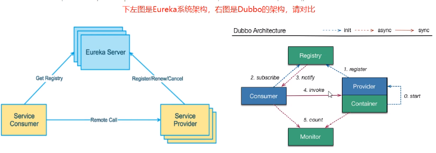
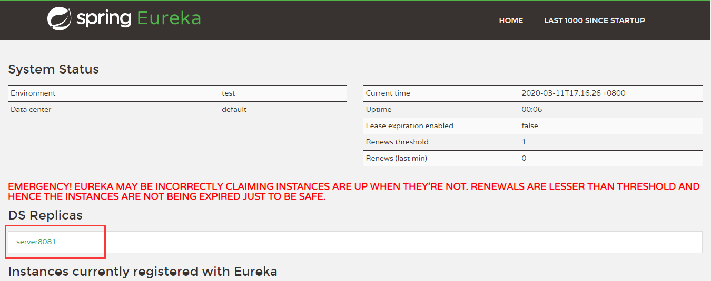
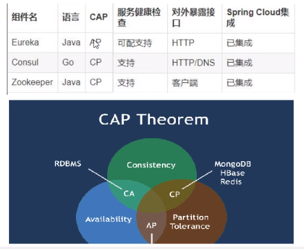
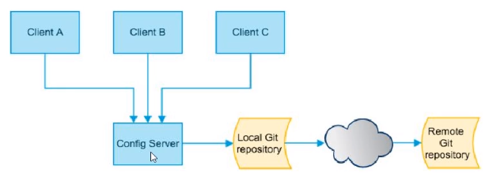
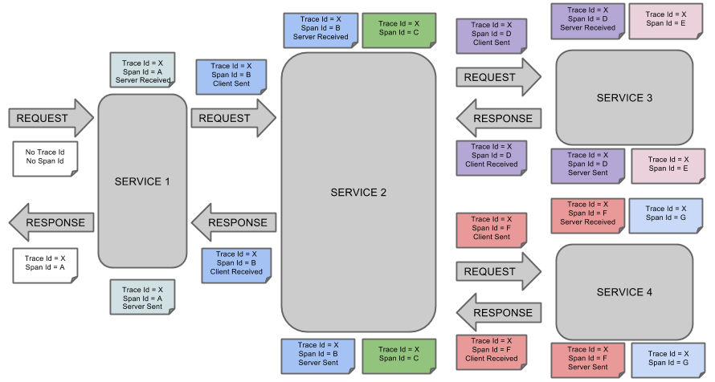

<h1 style="text-align:center">SpringCloud</h1>


# 1.服务注册与发现

## 1.1 Eureka

**已经停止更新**

Eureka采用了CS的设计架构，Eureka Server作为服务注册功能的服务器，它是服务注册中心。而系统中的其他微服务，使用Eureka的客户端连接到Eureka Server并维持心跳连接。这样系统的维护人员就可以通过Eureka Server来监控系统中各个微服务是否正常运行。
在服务注册与发现中，有一个注册中心。当服务器启动的时候，会把当前自己服务器的信息比如服务地址通讯地址等以别名方式注册到注册中心上。另一方(消费者|服务提供者) , 以该别名的方式去注册中心上获取到实际的服务通讯地址，然后再实现本地RPC调用RPC远程调用框架核心设计思想:在于注册中心，因为使用注册中心管理每个服务与服务之间的一个依赖关系(服务治理概念)。在任何RPC远程框架中，都会有一个注册中心(存放服务地址相关信息(接口地址))



###  1.1.1 核心组件

#### 1. Eureka Server

**Eureka Server **提供服务注册服务
各个微服务节点通过配置启动后，会在EurekaServer中进行注册， 这样EurekaServer中的服务注册表中将会存储所有可用服务节点的信息，服务节点的信息可以在界面中直观看到。

```xml
<dependency>
	<groupId>org.springframework.cloud</groupId>
	<artifactId>spring-cloud-starter-netflix-eureka-server</artifactId>
</dependency>
```

```yaml
server:
  port: 8081
eureka:
  instance:
#    服务端的实例名称
    hostname: localhost
  client:
#    是否在注册中心注册自己
    register-with-eureka: false
#    false表示自己就是注册中心
    fetch-registry: false
#    设置eureka server交互的地址查询服务和注册服务都需要依赖这个地址
    service-url:
      defaultZone: http://${eureka.instance.hostname}:${server.port}/eureka/
```

访问地址：http://localhost:8081/

#### 2. Eureka Client

**Eureka Client** 检查注册中新的服务是否还有心跳
是一个Java客户端，用于简化Eureka Server的交互，客户端同时也具备一个内置的、 使用轮询(round-robin)负载算法的负载均衡器在应用启动后，将会向Eureka Server发送心跳(默认周期为30秒)。 如果Eureka Server在多个心跳周期内没有接收到某个节点的心跳，EurekaServer将会从服务注册表中把这个服务节点移除(默认90秒)。

```xml
<dependency>
	<groupId>org.springframework.cloud</groupId>
	<artifactId>spring-cloud-starter-netflix-eureka-client</artifactId>
</dependency>
```

```yaml
eureka:
  client:
    #    是否在注册中心注册自己
    register-with-eureka: true
    #    false表示自己就是注册中心
    fetch-registry: true
    #    设置eureka server交互的地址查询服务和注册服务都需要依赖这个地址
    service-url:
      defaultZone: http://localhost:8081/eureka
```

#### 3. 集群配置 Eureka Server  Cluster

1. 修改C:\Windows\System32\drivers\etc\hosts

	```
		127.0.0.1       server8081
		127.0.0.1       server8091
	```

2. Server 相互注册指向对方地址

	server 8081:

	```yaml
	server:
	  port: 8081
	eureka:
	  instance:
	#    服务端的实例名称
	    hostname: server8081
	  client:
	#    是否在注册中心注册自己
	    register-with-eureka: false
	#    false表示自己就是注册中心
	    fetch-registry: false
	#    设置eureka server交互的地址查询服务和注册服务都需要依赖这个地址
	    service-url:
	      defaultZone: http://server8091:8091/eureka/
	```

	server 8091:

	```yaml
	server:
	  port: 8091
	eureka:
	  instance:
	    #    服务端的实例名称
	    hostname: server8091
	  client:
	    #    是否在注册中心注册自己
	    register-with-eureka: false
	    #    false表示自己就是注册中心
	    fetch-registry: false
	    #    设置eureka server交互的地址查询服务和注册服务都需要依赖这个地址
	    service-url:
	#      集群相互注册
	      defaultZone: http://server8081:8081/eureka/
	```
	
3. 客户端注册：

	```yaml
	server:
	  port: 8082
	eureka:
	  client:
	    #    是否在注册中心注册自己
	    register-with-eureka: true
	    #    false表示自己就是注册中心
	    fetch-registry: true
	    #    设置eureka server交互的地址查询服务和注册服务都需要依赖这个地址
	    service-url:
	#      单机版
	#      defaultZone: http://localhost:8081/eureka
	#集群
	      defaultZone: http://server8081:8081/eureka/,http://server8091:8091/eureka/
	```

	

	访问 server 8091 服务：

	

​	

#### 4. 集群配置 Eureka Client Cluster

##### 4.1 客户端配置

```yaml
server:
  port: 9002

eureka:
  client:
    register-with-eureka: true
    fetch-registry: true
    service-url:
      defaultZone: http://eureka-server-8001:8001/eureka/,http://eureka-server-8002:8002/eureka/
spring:
  application:
    name: eureka-client
```


配置 eureka.instance.appname

```yaml
eureka:
  instance:
    appname: eurekaclient9002
```


配置：eureka.instance.prefer-ip-address

```yaml
eureka:
  instance:
    appname: eurekaclient9002
    prefer-ip-address: true
```


配置：instance-id

```yaml
eureka:
  instance:
  	#默认注册到服务中心，显示的名称是 hostname+appname+port
    appname: eurekaclient9002 
    #使用ip地址来注册到服务中心，显示的是实例名称
    prefer-ip-address: true 
    #设置访问服务的ip地址，一般设置ip-address，都是因为需要通过外网来访问该服务，通常设置为公网ip
    ip-address: 127.0.0.1 
    #设置 注册服务中心，显示的实例名称
    instance-id: ${eureka.instance.ip-address}:${server.port}
```


集群配置相同 eureka.instance.appname

```yaml
eureka:
  instance:
    appname: eurekaclient
```


##### 4.2 消费者开启负载均衡（@LoadBalanced）：

```java
@Configuration
public class EurekaConfig {
    @Bean
    @LoadBalanced
    public RestTemplate restTemplate(){
        return new RestTemplate();
    }
}
```

```xml
<dependency>
    <groupId>org.springframework.cloud</groupId>
    <artifactId>spring-cloud-starter-netflix-eureka-client</artifactId>
    <version>2.2.2.RELEASE</version>
</dependency>
<dependencyManagement>
    <dependencies>
        <dependency>
            <groupId>org.springframework.cloud</groupId>
            <artifactId>spring-cloud-dependencies</artifactId>
            <version>${spring-cloud.version}</version>
            <type>pom</type>
            <scope>import</scope>
        </dependency>
    </dependencies>
</dependencyManagement>
```


#### 5. 消费者调用

consumer使用服务名调用客户端：

```java
@RestController
public class IndexController {
    private final  String url="http://EUREKA-CLIENT";
    @Autowired
    RestTemplate restTemplate;

    @RequestMapping(value = "/ticket/get",method = RequestMethod.GET)
    public String getTicket(){
        System.out.println("开始请求！");
        return restTemplate.getForObject(url+"/ticket",String.class);
    }
}
```

### 1.1.2 客户端服务发现

```java
@Autowired
DiscoveryClient discoveryClient;

public void discovery() {
    //1.
    List<String> services = discoveryClient.getServices();

    //2.
    List<ServiceInstance> instances = discoveryClient.getInstances("EUREKA-CLIENT");
    for (ServiceInstance instance : instances) {
        System.out.println(instance.getHost());//127.0.0.1
        System.out.println(instance.getInstanceId());//127.0.0.1:9002
        System.out.println(instance.getPort());//9002
        System.out.println(instance.getMetadata());//{management.port=9002}
        System.out.println(instance.getScheme());//http
        System.out.println(instance.getUri());//http://127.0.0.1:9001
    }
}
```

```java
//在client主启动类上加上注解
@EnableDiscoveryClient
```

### 1.1.3 Eureka-Server自我保护机制

默认情况下 Eureka Client 定时向 Eureka Server 端发送心跳包如果 Eureka 在 server 端在一定时间内(默认90秒)没有收到 Eureka Client 发送心跳包 ,便会直接从服务注册列表中剔除该服务,但是在短时间( 90秒中)内丢失了大量的服务实例心跳，这时候 Eureka Server 会开启自我保护机制,不会剔除该服务（该现象可能出现在如果网络不通，但是Eureka Client为出现宕机，此时如果换做别的注册中心如果一定时间内没有收到心跳会将剔除该服务,这样就出现了严重失误,因为客户端还能正常发送心跳，只是网络延迟问题，而保护机制是为了解决此问题而产生的）

管理自我保护机制：

eureka-server配置

```yaml
eureka:
	server:
    	enable-self-preservation: false
    
```

eureka-client端配置

```yaml
eureka:
  instance:
#    客户端发送心跳的时间间隔默认30
    lease-renewal-interval-in-seconds: 2
#    服务端在接收最后一次心跳的超时上限，超过就剔除注册服务默认90
    lease-expiration-duration-in-seconds: 1
```

## 1.2 Zookeeper

### 1.2.1 服务提供者

pom.xml

```xml
<dependency>
    <groupId>org.springframework.cloud</groupId>
    <artifactId>spring-cloud-starter-zookeeper-discovery</artifactId>
    <version>2.2.1.RELEASE</version>
    <exclusions>
        <exclusion>
            <groupId>org.apache.zookeeper</groupId>
            <artifactId>zookeeper</artifactId>
        </exclusion>
    </exclusions>
</dependency>
<dependency>
    <groupId>org.apache.zookeeper</groupId>
    <artifactId>zookeeper</artifactId>
    <version>3.5.7</version>
    <exclusions>
        <exclusion>
            <groupId>org.slf4j</groupId>
            <artifactId>slf4j-log4j12</artifactId>
        </exclusion>
    </exclusions>
</dependency>
```

application.yml

```yaml
server:
  port: 8001
spring:
  application:
    name: zookeeper-client
  cloud:
    zookeeper:
      connect-string: localhost:2181
```

主启动类：向 zookeeper 注册中心注册服务

```java
@SpringBootApplication
@EnableDiscoveryClient
public class ZkClientApplication {
    public static void main(String[] args){
        SpringApplication.run(ZkClientApplication.class,args);
    }
}    
```


### 1.2.2 服务消费者

pom 文件和客户端一样

配置 RestTemplate

```java
@Configuration
public class RestTemplateConfig {
    @Bean
    @LoadBalanced
    public RestTemplate restTemplate(){
        return new RestTemplate();
    }
}
```

主启动类：

```java
@SpringBootApplication
@EnableDiscoveryClient
public class ZkConsumerApplication {
    public static void main(String[] args) {
        SpringApplication.run(ZkConsumerApplication.class,args);
    }
}
```

调用：

```java 
@RestController
public class TicketController {
    private static final String CLEINT_URL = "http://zookeeper-client";
    @Autowired
    RestTemplate restTemplate;

    @GetMapping("/ticket")
    public String getTicket(){
        System.out.println("开始调用");
        return restTemplate.getForObject(CLEINT_URL+"/ticket",String.class);
    }
}
```

## 1.3  Consul

https://www.consul.io/intro/index.html

Consul特点：

- **服务发现**：Consul的客户端可以注册服务，例如 `api`或`mysql`，其他客户端可以使用Consul来发现给定服务的提供者。使用DNS或HTTP，应用程序可以轻松找到它们依赖的服务。
- **健康检查**：Consul客户端可以提供大量的健康检查，这些检查可以与给定服务（“ Web服务器返回200 OK”或与本地节点（“内存利用率低于90％”））相关联。操作员可以使用此信息来监视群集的运行状况，服务发现组件可以使用此信息将流量从不正常的主机发送出去。
- **KV存储**： 根据具体用途，应用程序可以使用Consul的键/值分层存储，包括动态配置，功能标记，协调，领导者选举等。简单的HTTP API 使其易于使用。
- **安全的服务通信**：Consul可以为服务生成和分发TLS证书以建立相互TLS连接。 [意图](https://www.consul.io/docs/connect/intentions.html) 可用于定义允许哪些服务进行通信。可以使用可以实时更改的意图轻松管理服务分段，而不用使用复杂的网络拓扑和静态防火墙规则。
- **多数据中心**：Consul开箱即用地支持多个数据中心。这意味着Consul的用户不必担心会构建其他抽象层以扩展到多个区域。

配置：

```yaml
spring:
  application:
    name: consul-consumer
  cloud:
    consul:
      host: localhost
      port: 8500
      discovery:
        service-name: ${spring.application.name}
```

主启动类：

```java
@SpringBootApplication
@EnableDiscoveryClient
public class ConsulConsumerApplication {
    public static void main(String[] args) {
        SpringApplication.run(ConsulConsumerApplication.class,args);
    }
}

```

调用服务：

```java

@RestController
public class TicketController {
    String URL = "http://consul-client";
    @Resource
    RestTemplate restTemplate;
    @GetMapping("/consumer/ticket")
    public String ticket(){
        return restTemplate.getForObject(URL+"/ticket",String.class);
    }
}
```


CAP:关注粒度是数据，而不是整体。

* C:Consistency(强一致性)

* A:Availability(可用性)

* P:partition tolerance（分区容错性）

最多只能同时较好的满足两个。
**CAP理论的核心是:** 一个分布式系统不可能同时很好的满足致性， 可用性和分区容错性这三需求,因此，根据CAP原理将NoSQL数据库分成了满足CA原则、满足CP原则和满足AP原则三大类:

* CA—单点集群，满足一致性,可用性的系统，通常在可扩展性上不太强大。

* CP(zookeeper/consul)一满足一致性,分区容忍必的系统，通常性能不是特别高。

* AP(Eureka)—满足可用性,分区容忍性的系统，通常可能对一致性要求低一些。

	三者比较：



# 2.服务调用

## 2.1 Ribbon

### 2.1.1概述

Spring Cloud Ribbon是基于Netflix Ribbon实现的一套**客户端负载均衡**的工具。

简单的说，Ribbon是Netflix发 布的开源项目，主要功能是提供**客户端的软件负载均衡算法和服务调用**。Ribbon客户端组件提供一系列完善的配置项如连接超时，重试等。简单的说，就是在配置文件中列出Load Balancer (简称LB)后面所有的机器，Ribbon会自动的帮助你基于某种规则(如简单轮询，随机连接等)去连接这些机器。我们很容易使用Ribbon实现自定义的负载均衡算法。

**LB负载均衡(Load Balance)：**简单的说就是将用户的请求平摊的分配到多个服务上,从而达到系统的HA (可用)。
常见的负载均衡有软件Nginx, LVS,硬件F5等。

**Ribbon本地负载均衡客户端VS Nginx服务端负载均衡区别：**

- **Nginx是服务器负载均衡**，客户端所有请求都会交给nginx, 然后由nginx实现转发请求。即负载均衡是由服务端实现的。

- **Ribbon本地负载均衡**，在调用微服务接C时候,会在注册中心上获取注册信息服务列表之后缓存到JVM本地,从而在本地实现RPC远程服务调用技术。

负载均衡类别：

- **集中式LB**
	即在服务的消费方consumer和提供方provider之间使用独立的LB设施(可以是硬件,如F5, 也可以是软件,如nginx), 由该设施负责把访问请求通过某种策略转发至服务的提供方;

- **进程内LB**

	将负载均衡逻辑集成到consumer，consumer从服务注册中心获知有哪些地址可用，然后自己再从这些地址中选择出一个合适的provider。

**Ribbon就属于进程内LB**,它只是一个类库, **集成于消费方进程**,消费方通过它来获取到服务提供方的地址。

**Ribbon:负载均衡+RestTemplate调用**

Ribbon在I作时分成两步

* 第一步先选择EurekaServer ,它优先选择在同一个区域内负载较少的server.

* 第二步再根据用户指定的策略，在从server取到的服务注册列表中选择一个地址。

	其中Ribbon提供了多种**策略**:比如轮询、随机和根据响应时间加权。

### 2.1.2 Rbbon核心组件IRULE

默认轮询


### 2.1.3 修改默认策略：

1. 在非主启动类包中加入配置规则：

	```java
	@Configuration
	public class LoadBanlanceRlue {
	
	    @Bean
	    public IRule loadbalanceRule(){
	        return new RandomRule();
	    }
	}
	```

2. 在主启动类中加入注解@**RibbonClient**指定负载策略

	```java
	@SpringBootApplication
	@EnableDiscoveryClient
	@RibbonClient(name = "eureka-client",configuration = LoadBanlanceRlue.class)
	public class ConsulConsumerApplication {
	    public static void main(String[] args) {
	        SpringApplication.run(ConsulConsumerApplication.class,args);
	    }
	}
	```

### 2.1.4 负载均衡算法

**负载均衡算法**: rest接口第几次请求数%服务器集群总数量=实际调用服务器位置下标，每次服务重启动后rest接口计数从1开始。

## 2.2 OpenFeign

Feign是一个**声明式WebService客户端**。 使用Feign能让编写Web Service客户端更加简单。
它的使用方法是**<span style="color:red">定义一个服务接口然后在上面添加注解</span>**。Feignt也**支持可拔插式的编码器和解码器**。

SpringCloud对Feign进行了封装使其支持了Spring MVC标准注解和HttpMessageConverters。

**Feign可以与Eureka和Ribbon组合使用以支持负载均衡**。

前面在使用Ribbon+ RestTemplate时,利用RestTemplate对http请求的封装处理,形成了一套模版化的调用方法。但是在实际开发中,由于对服务依赖的调用可能不止一处, 往往一个接口会被多处调用， 所以通常都会针对每个微服务自行封装一些客户端类来包装这些依赖服务的调用。所以，Feign在此基础上做了进一步封装, 由他来帮助我们定义和实现依赖服务接口的定义。在Feign的实现下,我们只需创建一个接口并使用注解的方式来配置它(以前是Dao接口上面标注Mapper注解现在是一个微服务接口上面标注一个Feign注解即可)，即可完成对服务提供方的接口绑定,简化了使用Spring cloud Ribbon时，自动封装服务调用客户端的开发量。
**Feign集成了Ribbon**
利用Ribbon维护了Payment的服务列表信息，并且通过轮询实现了客户端的负载均衡。与Ribbon不同的是，通过**feign只需要定义服务绑定接口且以声明式的方法**，优雅而简单的实现了服务调用。


### 2.2.1 配置

pom.xml

```xml
<!--openfeign-->
<dependency>
    <groupId>org.springframework.cloud</groupId>
    <artifactId>spring-cloud-starter-openfeign</artifactId>
    <version>2.2.2.RELEASE</version>
</dependency>
<!--eureka-client-->
<dependency>
    <groupId>org.springframework.cloud</groupId>
    <artifactId>spring-cloud-starter-netflix-eureka-client</artifactId>
    <version>2.2.2.RELEASE</version>
</dependency>
```

application.yml

```yaml
eureka:
  client:
    register-with-eureka: false
    fetch-registry: true
    service-url: # 集群
      defaultZone: http://eureka-server-8001:8001/eureka/,http://eureka-server-8002:8002/eureka/
```

服务接口：绑定接口（@FeignClient）且以声明式的方法(@GetMapping)

```java
@Service
@FeignClient(value="eureka-client")
public interface TicketService {

    @GetMapping(value = "/ticket")
    String getTicket();
}
```

主启动类（@EnableFeignClients）：

```java
@SpringBootApplication
@EnableFeignClients
public class OpenFeignConsumerApplication {
    public static void main(String[] args) {
        SpringApplication.run(OpenFeignConsumerApplication.class,args);
    }
}

```

### 2.2.2 超时控制

yml:

```yaml
  client:
    config:
      default:
        connectTimeout: 5000
        readTimeout: 5000
        Level: debug
```

# 3.服务降级

## 3.1 Hystrix

Hystrix是一个用于处理分布式系统的**延迟和容错**的开源库, 在分布式系统里,许多依赖不可避免的会调用失败,比如超时、异常等,Hystrix能够保证在一个依赖出问题的情况下， **不会导致整体服务失败，避免级联故障，以提高分布式系统的弹性**。
"**断路器**”本身是一种开关装置， 当某个服务单元发生故障之后,通过断路器的故障监控(类似熔断保险丝)，**向调用方返回一个符合预期的、可处理的备选响应(FallBack) ，而不是长时间的等待或者抛出调用方无法处理的异常**，这样就保证了服务调用方的线程不会被长时间、不必要地占用，从而避免了故障在分布式系统中的蔓延，乃至雪崩。

* 服务降级

	可以放到客户端和服务端，通常放到客户端

	导致服务降级的情况：

	1. 程序运行异常
	2. 超时
	3. 服务熔断
	4. 线程池/信号量满时

* 服务熔断

	**熔断机制**是应对雪崩效应的一-种微服务链路保护机制。当扇出链路的某个微服务出错不可用或者响应时间太长时,会进行服务的降级，进而熔断该节点微服务的调用，快速返回错误的响应信息。

	**当检测到该节点微服务调用响应正常后，恢复调用链路。**

	**服务熔断-》服务降级-》恢复调用链路**

	在Spring Cloud框架里,熔断机制通过Hystrix实现。Hystrix会监控微服务间调用的状况,当失败的调用到一定阈值,缺省是5秒内20次调用失败,就会启动熔断机制。熔断机制的注解是@HystrixCommand.

* 服务限流

## 3.2 示例

### 3.2.1 client端配置

client pom.xml

```xml
<dependency>
    <groupId>org.springframework.cloud</groupId>
    <artifactId>spring-cloud-starter-netflix-eureka-client</artifactId>
    <version>2.2.2.RELEASE</version>
</dependency>
<dependency>
    <groupId>org.springframework.cloud</groupId>
    <artifactId>spring-cloud-starter-netflix-hystrix</artifactId>
    <version>2.2.2.RELEASE</version>
</dependency>
```

服务降级设置（**@HystrixCommand**）：

```java
  @GetMapping("/ticket/timeout")
  @HystrixCommand(fallbackMethod="timeout3",commandProperties={            @HystrixProperty(name="execution.isolation.thread.timeoutInMilliseconds",value="3000")
    })
    public String timeout(){
        try {
            TimeUnit.SECONDS.sleep(5);
        } catch (InterruptedException e) {
            e.printStackTrace();
        }
        return "timeout5秒";
    }

    public String timeout3(){
        try {
            TimeUnit.SECONDS.sleep(3);
        } catch (InterruptedException e) {
            e.printStackTrace();
        }
        return "系统超时，请稍后再试";
    }
```

主启动类（**@EnableCircuitBreaker**）：

```java
@SpringBootApplication
@EnableDiscoveryClient
@EnableCircuitBreaker
public class HystrixClientApplication {
    public static void main(String[] args) {
        SpringApplication.run(HystrixClientApplication.class,args);
    }
}
```

### 3.2.2 消费者配置

pom.xml

```xml
 <dependency>
     <groupId>org.springframework.cloud</groupId>
     <artifactId>spring-cloud-starter-netflix-eureka-client</artifactId>
     <version>2.2.2.RELEASE</version>
</dependency>
<dependency>
    <groupId>org.springframework.cloud</groupId>
    <artifactId>spring-cloud-starter-netflix-hystrix</artifactId>
    <version>2.2.2.RELEASE</version>
</dependency>
<dependency>
    <groupId>org.springframework.cloud</groupId>
    <artifactId>spring-cloud-starter-openfeign</artifactId>
    <version>2.2.2.RELEASE</version>
</dependency>
```

application.yml

```yaml
server:
  port: 80
spring:
  application:
    name: hystrix-consumer
eureka:
  client:
    fetch-registry: true
    register-with-eureka: false
    service-url:
      defaultZone: http://localhost:8001/eureka
feign:
  hystrix:
    enabled: true
```

主启动类：

```java
@SpringBootApplication
@EnableFeignClients
@EnableCircuitBreaker
public class HystrixConsumerApplication {
    public static void main(String[] args) {
        SpringApplication.run(HystrixConsumerApplication.class,args);
    }
}
```

服务降级设置

```java

@GetMapping("/consumer/ticket/timeout")
@HystrixCommand(fallbackMethod="timeout2",commandProperties={            @HystrixProperty(name="execution.isolation.thread.timeoutInMilliseconds",value="2000") })
String timeout() {
    return ticketService.timeout();
}
String timeout2() {
    return "响应超时";
}
```

### 3.2.3 设置默认降级处理

```java
@DefaultProperties(defaultFallback="timeout2")
@RestController
public class TicketController
```

### 3.2.4 服务降级-fallback

实现FeignClien接口：

```java
@FeignClient(value = "hystrix-client",fallback = FallBackServiceImpl.class)
public interface TicketService {

    @GetMapping("/ticket/get")
     String ticket();

    @GetMapping("/ticket/timeout")
     String timeout();
}
@Component
public class FallBackServiceImpl implements TicketService {
    @Override
    public String ticket() {
        return "ticket fallback";
    }

    @Override
    public String timeout() {
        return "timeout fallback";
    }
}
```

### 3.2.5 服务熔断

#### 3.2.5.1 实现

```java
   @HystrixCommand(fallbackMethod="timeout3",commandProperties={
   @HystrixProperty(name= "circuitBreaker.enable",value="true"),// 是否开启断路器
            @HystrixProperty(name="circuitBreaker.requestVolumeThreshold",value="10"),//请求次数
            @HystrixProperty(name="circuitBreaker.sleepWindowInMilliseconds",value="10000"),//时间窗口期
            @HystrixProperty(name="circuitBreaker.errorThresholdPercentage",value="60")// 失败率达到多少后跳闸
    })
    //具体属性在HystrixCommandProperties类中
    public String timeout(){
        try {
            TimeUnit.SECONDS.sleep(5);
        } catch (InterruptedException e) {
            e.printStackTrace();
        }
        return "timeout5秒";
    }
```

涉汲到断路器的三个重要参数:**快照时间窗、请求总数阀值、错误百分比阀值。**

1. 快照时间窗:断路器确定是否打开需要统计一些请求和错误数据， 而统计的时间范围就是快照时间窗，默认为最近的10秒。

2. 请求总数阀值:在快照时间窗内，必须满足请求总数阀值才有资格熔断。默认为20,意味着在10秒内,如果该hystrix命令的调用次数不足20次,
	即使所有的请求都超时或其他原因失败，断路器都不会打开。

3. 错误百分比阀值:当请求总数在快照时间窗内超过了阀值,比如发生了30次调用，如果在这30次调用中，有15次发生了超时异常,也就是超过
	50%的错误百分比,在默认设定50%阀值情况下，这时候就会将断路器打开。

#### 3.2.5.2: 服务熔断类型

* 熔断打开
	请求不再进行调用当前服务，内部设置时钟一般为MTTR (平均故障处理时间)，当打开时长达到所设时钟则进入半熔断状态

* 熔断关闭
	熔断关闭不会对服务进行熔断

* 熔断半开
	部分请求根据规则调用当前服务，如果请求成功且符合规则则认为当前服务恢复正常，关闭熔断

https://github.com/Netflix/Hystrix/wiki/How-it-Works


## 3.3 Hystrix dashboard

在pom.xml中引入jar

```xml
<dependency>
    <groupId>org.springframework.cloud</groupId>
    <artifactId>spring-cloud-starter-netflix-hystrix-dashboard</artifactId>
    <version>2.2.2.RELEASE</version>
</dependency>


```

主启动类中加入@EnableHystrixDashboard

# 4.服务网关

## 4.1 zuul

## 4.2 Gateway

Gateway是zull1.x 的替代

SpringCloud Gateway是Spring Cloud的一个全新项目，于Spring 5.0+ Spring Boot 2.0和Project Reactor等技术开发的网关，它旨在为微服务架构提供一种简单有效的统一的API路由管理方式。
SpringCloud Gateway作为Spring Cloud生态系统中的网关,目标是替代Zuul, 在Spring Cloud 2.0以上版本中，没有对新版本的Zuul 2.0以上最新高性能版本进行集成，仍然还是使用的Zuul 1.x非Reactor模式的老版本。而为了提升网关的性能，SpringCloud Gateway是基于WebFlux框架实现的，而WebFlux框架底层则使用了高性能的eactor模式通信框架Netty。
Spring Cloud Gateway的目标提供统一 的路由方式且基于Filter链的方式提供了网关基本的功能，例如:安全，监控/指标,和限流。

### **4.2.1 基本概念**：

* Route（路由）

	路由是构建网关的基本模块，它由ID，目标URI, 一系列的断言和过滤器组成，如果断言为true则匹配该路由

* Predicate（断言）

	参考的是Java8的java.util.function.Predicate
	开发人员可以匹配HTTP请求中的所有内容(例如请求头或请求参数)，如果请求与断言相匹配则进行路由

* Filter（过滤）

	指的是Spring框架中GatewayFilter的实例， 使用过滤器，可以在请求被路由前或者之后对请求进行修改。

### 4.2.2 Spring Cloud Gateway功能：

- 基于Spring Framework 5，Project Reactor和Spring Boot 2.0构建
- 能够匹配任何请求属性上的路由。
- 断言和过滤具体路由。
- Hystrix断路器集成。
- Spring Cloud DiscoveryClient集成
- 容易编写的断言和过滤器
- 请求速率限制
- 路径改写

### 4.2.3 工作流程：

客户端向Spring Cloud Gateway发出请求。如果网关处理程序映射确定请求与路由匹配，则将其发送到网关Web处理程序。该处理程序通过特定于请求的过滤器链来运行请求。筛选器由虚线分隔的原因是，筛选器可以在发送代理请求之前和之后运行逻辑。所有“前置”过滤器逻辑均被执行。然后发出代理请求。发出代理请求后，将运“后”过滤器逻辑。


### 4.2.4 具体实现

配置路由：

1. 通过yaml

	```yaml
	 cloud:
	    gateway:
	      routes:
	#        路由ID
	        - id : route
	#        匹配后提供服务的路由地址
	          uri: http://localhost:8081
	#        断言，路径匹配则路由
	          predicates:
	            - Path=/ticket/get
	```

	

2. 通过配置类

	```java
	 @Configuration
	public class GatewayConfig {
	    @Bean
	    public RouteLocator customRouteLocator(RouteLocatorBuilder builder) {
	        return builder.routes()
	                .route("path_route", r -> r.path("/get")
	                        .uri("http://httpbin.org"))
	                .route("host_route", r -> r.host("*.myhost.org")
	                        .uri("http://httpbin.org"))
	                .route("rewrite_route", r -> r.host("*.rewrite.org")
	                        .filters(f -> f.rewritePath("/foo/(?<segment>.*)", "/${segment}"))
	                        .uri("http://httpbin.org"))
	                .route("hystrix_route", r -> r.host("*.hystrix.org")
	                        .filters(f -> f.hystrix(c -> c.setName("slowcmd")))
	                        .uri("http://httpbin.org"))
	                .route("hystrix_fallback_route", r -> r.host("*.hystrixfallback.org")
	                        .filters(f -> f.hystrix(c -> c.setName("slowcmd").setFallbackUri("forward:/hystrixfallback")))
	                        .uri("http://httpbin.org"))
	                .build();
	    }
	}
	```

动态路由：

```yaml
server:
  port: 9999
eureka:
  instance:
    hostname: gateway-service
  client:
    register-with-eureka: true
    fetch-registry: true
    service-url:
      defaultZone: http://localhost:8001/eureka
spring:
  application:
    name: gateway
  cloud:
    gateway:
      discovery:
        locator:
          #          开启动态路由
          enabled: true
      routes:
        - id: route
          uri: lb://hystrix-client
          predicates:
           - Path=/ticket/get
           
```

测试通过网关访问：http://localhost:9999/ticket/get


# 5.服务配置



## 5.1 SpringCloud Config

SpringCloud Config为微服务架构中的微服务提供集中化的外部配置支持，配置服务器**为各个不同微服务应用**的所有环境提供了一个**中心化的外部配置**。

### 5.1.1 环境搭建

#### 5.1.1.1 config center

pom.xml

```xml
<dependency>
    <groupId>org.springframework.cloud</groupId>
    <artifactId>spring-cloud-config-server</artifactId>
    <version>2.2.2.RELEASE</version>
</dependency>

```

application.yml

```yaml
server:
  port: 8088
spring:
  application:
    name: config-server
  cloud:
    config:
      server:
        git:
      #          git地址
          uri: https://github.com/pengmengsheng/SpringCloud.git
      #         搜索目录
          search-paths: SpringCloud
      #     读取分支
      label: master
eureka:
  client:
    service-url:
      defaultZone: http://localhost:8001/eureka

```

#### 5.1.1.2 config client

pom.xml

```xml
<dependency>
	<groupId>org.springframework.cloud</groupId>
	<artifactId>spring-cloud-starter-config</artifactId>
</dependency>
```

application.yml

```yaml
server:
  port: 80
spring:
  application:
    name: config-client
  cloud:
    config:
#      分支名称
      #      配置文件名称
      name: config
      #      配置中心地址
      profile: test
      label: master
      uri: http://localhost:8088
eureka:
  client:
    service-url:
      defaultZone: http://localhost:8001/eureka
```


### 5.1.2 读取配置规则

```
/ {application} / {profile} [/ {label}]
/{application}-{profile}.yml
/{label}/{application}-{profile}.yml
/{application}-{profile}.properties
/{label}/{application}-{profile}.properties
```

### 5.1.3 动态刷新配置

pom.xml

```xml
<dependency>
    <groupId>org.springframework.boot</groupId>
    <artifactId>spring-boot-starter-actuator</artifactId>
</dependency>
```

application.yml

```yaml

management:
  endpoints:
    web:
      exposure:
        include: "*"
```

controller

```java
@RestController
@RefreshScope
public class IndexController

```

发送post请求

curl -X post "http://localhost/actuator/refresh"

# 6.服务(消息)总线-SpringCloud Bus

**什么是总线**
在微服务架构的系统中，通常会使用**轻量级的消息代理**来构建一个**共用的消息主题**， 并让系统中所有微服务实例都连接上来。由于**该主题中产生的消息会被所有实例监听和消费，所以称它为消息总线**。在总线上的各个实例，都可以方便地广播-些需要让其他连接在该主题 上的实例都知道的消息。
**基本原理**
ConfigClient实例都监听MQ中同-个topic(默认是springCloudBus)。当-一个服务刷新数据的时候，它会把这个信息放入到Topic中，这样其它监听同一Topic的服务就能得到通知，然后去更新自身的配置。

## 6.1 消息通知方式

1. 利用消息总线触发一个客户端/bus/refresh,而刷新所有客户端的配置口

2. 利用消息总线触发一个服务端ConfigServer的/bus/refresh端点，而刷新所有客户端的配置


## 6.2 动态刷新所有通知

### 6.2.1 安装rabbitmq

### 6.2.2 配置消息中心

pom.xml

```xml
<dependency>
    <groupId>org.springframework.cloud</groupId>
    <artifactId>spring-cloud-starter-bus-amqp</artifactId>
    <version>2.2.1.RELEASE</version>
</dependency>

```

application.yml

```yaml
server:
  port: 8088
spring:
  application:
    name: config-server
  cloud:
    config:
      server:
        git:
          uri: https://github.com/pengmengsheng/SpringCloud.git

          search-paths: SpringCloud

          skipSslValidation: true
      #     读取分支
      label: master
eureka:
  client:
    service-url:
      defaultZone: http://localhost:8001/eureka

# rabbitmq
  rabbitmq:
    host: localhost
    port: 5672
    username: guest
    password: guest
#  暴露bus-refresh刷新端点
management:
  endpoints:
    web:
      exposure:
        include: "bus-refresh"
```


### 6.2.3 配置消息客户端

pom中加入spring-cloud-starter-bus-amqp

application.yml

```yaml
server:
  port: 8089
spring:
  application:
    name: cofig-client8089
  cloud:
    config:
      uri: http://localhost:8088
      #      配置文件名称
      name: config
      profile: test
      label: master
eureka:
  client:
    service-url:
      defaultZone: http://localhost:8001/eureka
  # rabbitmq
  rabbitmq:
    host: localhost
    port: 5672
    username: guest
    password: guest
management:
  endpoints:
    web:
      exposure:
        include: "*"
```

### 6.2.4 刷新消息服务中心

curl -X post "http://localhost:8088/actuator/bus-refresh"

## 6.3 定点通知

格式: http://localhost:配置中心的端口号/actuator/bus-refresh/ {destination}
/bus/refresh请求不再发送到具体的服务实例上,而是发给config server并通过destination参数类指定需要更新配置的服务或实例。

curl -X post "http://localhost:8088/actuator/bus-refresh/cofig-client8089:8809"

## 6.4 工作流程


# 7. SpringCloud Stream

消息驱动：屏蔽底层消息中间件的差异，降低切换成本，统一消息的编程模型。

一个Spring Cloud Stream应用程序由一个核心的消息中间件构成，通过Spring Cloud Stream实现应用程序与外部输入、输出通道之间的通信，通过通道实现特定的中间件绑定器和外部代理的连接。


核心模块：

* **Destination Binders**：负责与外部消息系统集成
* **Destination Bindings**：绑定外部消息系统和应用程序提供的生产者和消费者。
* **Message 消息**：生产者和消费者与Destination Binders 之间通信的数据结构。

通过定义绑定器Binder作为中间层，实现了应用程序与消息中间件细节之间的隔离。


## 7.1 RabbitMQ

### 7.1.1 基本概念

* **Exchange**

	交换器，用来接收生产者发送的消息并将这些消息路由给服务器中的队列。

	Exchange有4种类型: 

	* **direct(默认)**

	* **fanout**

	* **topic**

	* **headers**

* **Queue**

	消息队列，用来保存消息直到发送给消费者。它是消息的容器。也是消息的终点。一个消息可投入一个或多个队列。消息一直在队列里面，等待消费者连接到这个队列将其取走。

* **Binding**

	绑定，用于消息队列和交换器之间的关联。一个绑定就是基于路由键将交换器和消息队列连接起来的路由规则，所以可以将交换器理解成一个由绑定构成的路由表。
	Exchange和Queue的绑定可以是多对多的关系。

* **Connection**

	网络连接，比如一个TCP连接。

* **Channel**

	信道，多路复用连接中的一条独立的双向数据流通道。信道是建立在真实的TCP连接内的虚拟连接、AMQP命令都是通过信道发出去的，不管是发布消息些动作都是通过信道完成。因为对于操作系统来说建立和销毁TCP都是非常昂贵的开销，所以引入了信道的概念，以复用一条TCP连接。

* **Virtual Host**
	虚拟主机，表示一批交换器、消息队列和相关对象。虚拟主机是共享相同的身份认证和加密环境的独立服务器域。每个vhost本质上就是一个mini版的RabbitMQ服务器，拥有自己的队列、交换器、绑定和权限机制。vhost 是AMQP 概念的基础，必须在连接时指定，RabbitMQ默认的vhost是/。

* **Broker**

	消息队列服务器的实体。


### 7.1.2 RabbitMQ运行机制

AMQP中消息的路由过程和Java开发者熟悉的JMS存在一些差别， AMQP中增加了Exchange和Binding的角色。生产者把消息发布到Exchange上，消息最终到达队列并被消费者接收，而Binding决定交换器的消息应该发送到那个队列。


### 7.1.3 Exchange Type

* **Direct Exchange**：
	消息中的路由键（routing key）如果和Binding中的binding key一致，交换器将消息发到对应的队列中。**路由键与队列名<span style="color:red;">完全匹配</span>**，如果一个队列绑定到交换机要求路由键为"dog"，则只转发routing key 标记为"dog"的消息，不会转发"dog.puppy"，也不会转发"dog.guard"等等。**它是完全匹配、单播的模式（点对点模式），路由key一对一匹配队列**。


* **Fanout Exchange：**
	每个发到fanout类型交换器的消息都会分到所有绑定的队列上去。fanout交换器不处理路由键，只是简单的将队列绑定到交换器上，**每个发送到交换器的消息都会被转发到与该交换器绑定的所有队列上，只要与队列绑定,队列都能接收到，与路由key无关**。

	很像子网广播，每台子网内的主机都获得了一份复制的消息。fanout类型转发消息是最快的。

	

* **Topic Exchange：**
	topic交换器**通过模式匹配分配消息的路由键属性**，将路由键和某个模式进行匹配，此时队列需要绑定到一个模式上。它将路由键和绑定键的字符串切分成单词，这些单词之间用点隔开。**队列name符合路由key匹配模式都能接收到消息。**

	**通配符：**符号"#“和符号” * "。# 匹配0个或多个单词，* 匹配一个单词。

	

### 7.1.4 具体实现

#### 7.1.4.1 消息提供者

pom.xml引入spring-cloud-starter-stream-rabbit

```xml
<dependency>
    <groupId>org.springframework.cloud</groupId>
    <artifactId>spring-cloud-starter-stream-rabbit</artifactId>
    <version>3.0.3.RELEASE</version>
</dependency>
```

application.yml

```yaml
server:
  port: 8088
spring:
  application:
    name: cloud-stream-provider
  cloud:
    stream:
      binders:
        defaultRabbit:
          type: rabbit
          environment:
            spring:
              rabbitmq:
                host: localhost
                port: 5672
                username: guest
                password: guest
      bindings:
        output:
          destination: rabbitexchange
          content-type: application/json
          binder: defaultRabbit
eureka:
  client:
    service-url:
      defaultZone: http://localhost:8001/eureka
```

消息发送

```java
@EnableBinding(Source.class)//消息发送管道
public class MessageProviderImpl implements MessageProvider {
    @Resource
    private MessageChannel output;

    @Override
    public String send() {
        String msg = UUID.randomUUID().toString();
        output.send(MessageBuilder.withPayload(msg).build());
        System.out.println(msg);
        return null;
    }
}
```

#### 7.1.4.2 消息消费者

application.yml

```yaml
server:
  port: 8081
spring:
  application:
    name: cloud-stream-client8081
  cloud:
    stream:
      binders:
        defaultRabbit:
          type: rabbit
          environment:
            spring:
              rabbitmq:
                host: localhost
                port: 5672
                username: guest
                password: guest
      bindings:
        input:
          destination: rabbitexchange
          content-type: application/json
          binder: defaultRabbit
eureka:
  client:
    service-url:
      defaultZone: http://localhost:8001/eureka
  instance:
    prefer-ip-address: true

```

接收消息：

```java
@Component
@EnableBinding(Sink.class)//接收消息
public class MessageReveiveController {

    @Value("${server.port}")
    private String port;

    @StreamListener(Sink.INPUT)
    public void receiveMsg(Message<?> msg){
        System.out.println("接收到消息："+msg.getPayload()+"\t port:"+port);
    }
}
```

### 7.1.5 group

分组：避免消息重复消费，持久化。

消费者设置相同group

```yaml
      bindings:
        input:
          destination: rabbitexchange
          content-type: application/json
          binder: defaultRabbit
          group: rabbit-client
```

# 8 .SpringCloud Sleuth

Spring Cloud Sleuth为[Spring Cloud](https://cloud.spring.io/)实现了分布式跟踪解决方案。

在微服务框架中，一个由客户端发起的请求在后端系统中会经过多个不同的的服务节点调用来协同产生最后的请求结果，每一个前段请求都会形成一 条复杂的分布式服务调用链路，链路中的任何一 环出现高延时或错误都会引起起整个请求最后的失败。

**SpringCloud Sleuth 负责数据收集，Zipkin负责链路跟踪展现**。

术语：

* **span**：基本工作单位。例如，发送RPC是一个新的span，就像发送响应到RPC一样。span由跨度的唯一64位ID和span所属的跟踪的另一个64位ID标识。span还具有其他数据，例如描述，带有时间戳的事件，键值注释（标签），引起span的跨区ID和进程ID（通常为IP地址）。

	span可以启动和停止，并且可以跟踪其时序信息。创建span后，您必须在将来的某个时间点将其停止。

	开始跟踪的初始span称为 root span。该span的ID的值等于跟踪ID。

* **trace**：形成树状结构的一组span。例如，如果您运行分布式大数据存储，则跟踪可能是由`PUT`请求形成的。

下图显示了**Span**和**Trace**以及[Zipkin](https://gitee.com/mirrors/zipkin/)注解在系统中的逻辑：


## 8.1 代码实现

1. 下载zipkin

2. 引入jar包

	```xml
	<dependency>
	    <groupId>org.springframework.cloud</groupId>
	    <artifactId>spring-cloud-starter-sleuth</artifactId>
	    <version>2.2.2.RELEASE</version>
	</dependency>
	```

3. 修改application.yml

	```yaml
	spring: 
	  sleuth:
	    sampler:
	    # 1:全部收集，0：不收集
	      probability: 1
	```

4. 消费者请求服务提供者

5. 在zipkin中查看请求链路：http://localhost:9411

# 9. Spring Cloud Alibaba

Spring Cloud Alibaba 致力于提供微服务开发的一站式解决方案。此项目包含开发分布式应用微服务的必需组件，方便开发者通过 Spring Cloud 编程模型轻松使用这些组件来开发分布式应用服务。

依托 Spring Cloud Alibaba，您只需要添加一些注解和少量配置，就可以将 Spring Cloud 应用接入阿里微服务解决方案，通过阿里中间件来迅速搭建分布式应用系统。

## 9.1 主要功能

- **服务限流降级**：默认支持 WebServlet、WebFlux, OpenFeign、RestTemplate、Spring Cloud Gateway, Zuul, Dubbo 和 RocketMQ 限流降级功能的接入，可以在运行时通过控制台实时修改限流降级规则，还支持查看限流降级 Metrics 监控。
- **服务注册与发现**：适配 Spring Cloud 服务注册与发现标准，默认集成了 Ribbon 的支持。
- **分布式配置管理**：支持分布式系统中的外部化配置，配置更改时自动刷新。
- **消息驱动能力**：基于 Spring Cloud Stream 为微服务应用构建消息驱动能力。
- **分布式事务**：使用 @GlobalTransactional 注解， 高效并且对业务零侵入地解决分布式事务问题。。
- **阿里云对象存储**：阿里云提供的海量、安全、低成本、高可靠的云存储服务。支持在任何应用、任何时间、任何地点存储和访问任意类型的数据。
- **分布式任务调度**：提供秒级、精准、高可靠、高可用的定时（基于 Cron 表达式）任务调度服务。同时提供分布式的任务执行模型，如网格任务。网格任务支持海量子任务均匀分配到所有 Worker（schedulerx-client）上执行。
- **阿里云短信服务**：覆盖全球的短信服务，友好、高效、智能的互联化通讯能力，帮助企业迅速搭建客户触达通道。

## 9.2 组件

**[Sentinel](https://github.com/alibaba/Sentinel)**：把流量作为切入点，从流量控制、熔断降级、系统负载保护等多个维度保护服务的稳定性。

**[Nacos](https://github.com/alibaba/Nacos)**：一个更易于构建云原生应用的动态服务发现、配置管理和服务管理平台。

**[RocketMQ](https://rocketmq.apache.org/)**：一款开源的分布式消息系统，基于高可用分布式集群技术，提供低延时的、高可靠的消息发布与订阅服务。

**[Dubbo](https://github.com/apache/dubbo)**：Apache Dubbo™ 是一款高性能 Java RPC 框架。

**[Seata](https://github.com/seata/seata)**：阿里巴巴开源产品，一个易于使用的高性能微服务分布式事务解决方案。

**[Alibaba Cloud ACM](https://www.aliyun.com/product/acm)**：一款在分布式架构环境中对应用配置进行集中管理和推送的应用配置中心产品。

**[Alibaba Cloud OSS](https://www.aliyun.com/product/oss)**: 阿里云对象存储服务（Object Storage Service，简称 OSS），是阿里云提供的海量、安全、低成本、高可靠的云存储服务。您可以在任何应用、任何时间、任何地点存储和访问任意类型的数据。

**[Alibaba Cloud SchedulerX](https://help.aliyun.com/document_detail/43136.html)**: 阿里中间件团队开发的一款分布式任务调度产品，提供秒级、精准、高可靠、高可用的定时（基于 Cron 表达式）任务调度服务。

**[Alibaba Cloud SMS](https://www.aliyun.com/product/sms)**: 覆盖全球的短信服务，友好、高效、智能的互联化通讯能力，帮助企业迅速搭建客户触达通道。

更多组件请参考 [Roadmap](https://github.com/alibaba/spring-cloud-alibaba/blob/master/Roadmap-zh.md)。


# 10 Spring Cloud Alibaba-Nacos

官网：https://nacos.io/zh-cn/docs/quick-start.html

管理界面：[http://localhost:8848](http://localhost:8848/) 

在父pom中引入依赖

```xml
<dependency>
    <groupId>com.alibaba.cloud</groupId>
    <artifactId>spring-cloud-alibaba-dependencies</artifactId>
    <version>${spring.cloud.alibaba.version}</version>
    <type>pom</type>
    <scope>import</scope>
</dependency>
```


## 10.1 服务注册与发现

### 10.1.1 服务提供者

pom.xml

```xml
 <dependencies>
        <dependency>
            <groupId>org.springframework.boot</groupId>
            <artifactId>spring-boot-starter-web</artifactId>
        </dependency>

        <dependency>
            <groupId>org.springframework.boot</groupId>
            <artifactId>spring-boot-starter-actuator</artifactId>
        </dependency>

        <dependency>
            <groupId>com.alibaba.cloud</groupId>
            <artifactId>spring-cloud-starter-alibaba-nacos-discovery</artifactId>
        </dependency>
    </dependencies>

    <build>
        <plugins>
            <plugin>
                <groupId>org.springframework.boot</groupId>
                <artifactId>spring-boot-maven-plugin</artifactId>
            </plugin>
        </plugins>
    </build>

```

application.yml

```yaml
server:
  port: 9090
spring:
  application:
    name: nacos-provider
  cloud:
    nacos:
      discovery:
        server-addr: localhost:8848
management:
  endpoints:
    web:
      exposure:
        include: *

```

主启动类

```java
@SpringBootApplication
@EnableDiscoveryClient
public class NacosProvider9090Application {
    public static void main(String[] args) {
        SpringApplication.run(NacosProvider9090Application. class,args);
    }
}
```

### 10.1.2 服务消费者

application.yml

```yaml
server:
  port: 80
spring:
  application:
    name: nacos-consumer
  cloud:
    nacos:
      discovery:
        server-addr: localhost:8848

 service:
  nacos-service: http://nacos-provider

```

访问服务提供者：

```java
@RestController
public class EchoController {
    @Resource
    RestTemplate restTemplate;
    @Value("${ service.nacos-service}")
    private String SERVICE_URL;

    @GetMapping("/echo/{id}")
    public String echo(@PathVariable String id){
        return restTemplate.getForObject(SERVICE_URL+"/echo/"+id,String.class);
    }
}
```

## 10.2 配置中心

### 10.2.1 配置

1. pom.xml添加依赖

```xml
<dependency>
    <groupId>com.alibaba.cloud</groupId>
    <artifactId>spring-cloud-starter-alibaba-nacos-config</artifactId>
</dependency>
```

2. 新建bootstrap.yml

```yaml
server:
  port: 3377
spring:
  application:
    name: nacos-config-center
  cloud:
    nacos:
      discovery:
        #        nacos作为注册中心
        server-addr: localhost:8848
      config:
        #     nacos作为配置中心
        server-addr: localhost:8848
#        指定yaml格式配置
        file-extension: yaml

```

说明：之所以需要配置 `spring.application.name` ，是因为它是构成 Nacos 配置管理 `dataId`字段的一部分。

在 Nacos Spring Cloud 中，`dataId` 的完整格式如下：

```plain
${prefix}-${spring.profile.active}.${file-extension}
```

- `prefix` 默认为 `spring.application.name` 的值，也可以通过配置项 `spring.cloud.nacos.config.prefix`来配置。
- `spring.profile.active` 即为当前环境对应的 profile，详情可以参考 [Spring Boot文档](https://docs.spring.io/spring-boot/docs/current/reference/html/boot-features-profiles.html#boot-features-profiles)。 **注意：当 `spring.profile.active` 为空时，对应的连接符 `-` 也将不存在，dataId 的拼接格式变成 `${prefix}.${file-extension}`**
- `file-exetension` 为配置内容的数据格式，可以通过配置项 `spring.cloud.nacos.config.file-extension` 来配置。目前只支持 `properties` 和 `yaml` 类型。

3. 在Nacos管理界面中配置dataId

4. 通过 Spring Cloud 原生注解 `@RefreshScope` 实现配置自动更新：

  ```java
  @RestController
  @RequestMapping("/config")
  @RefreshScope
  public class ConfigController {
  
      @Value("${useLocalCache:false}")
      private boolean useLocalCache;
  
      @RequestMapping("/get")
      public boolean get() {
          return useLocalCache;
      }
  }
  ```


### 10.2.2 参数 

* **Namespaces**

	> 命名空间用于隔离不同租户的配置。跨不同名称空间的组和数据ID可以相同。命名空间的典型场景是隔离不同环境的配置，例如，开发/测试环境与生产环境（配置和服务等）之间的隔离。

	如果未指定名称空间，则`${spring.cloud.nacos.config.namespace}`使用 Nacos 的“public”名称空间。

	此配置必须和bootstrap.properties文件中`spring.cloud.nacos.config.namespace` 中的值相同。

	

* **Groups**

	`{spring.cloud.nacos.config.group}`未定义配置时，默认情况下使用DEFAULT_GROUP 。如果需要定义自己的组，则可以在以下属性中进行定义：

	```properties
	spring.cloud.nacos.config.group = DEVELOP_GROUP
	```

	此配置必须和bootstrap.properties文件中`spring.cloud.nacos.config.group`值相同。

* **Data Id**